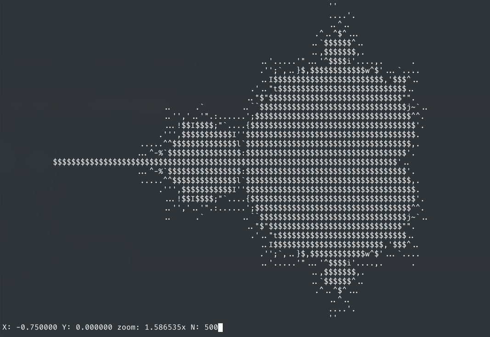

# ASCII Mandelbrot
Navigate through [Mandelbrot set](https://en.wikipedia.org/wiki/Mandelbrot_set) right in the terminal

### Installation
`$ make`

`$ ./mandelbrot`

### Usage
**w/a/s/d** to navigate

**Arrow keys** to zoom in/out

**[ ]** to decrease/increase contrast

### TODOs
- Support for multi-threading
- More efficient inner loop
- Support for multibrot set
- Command-line interface
